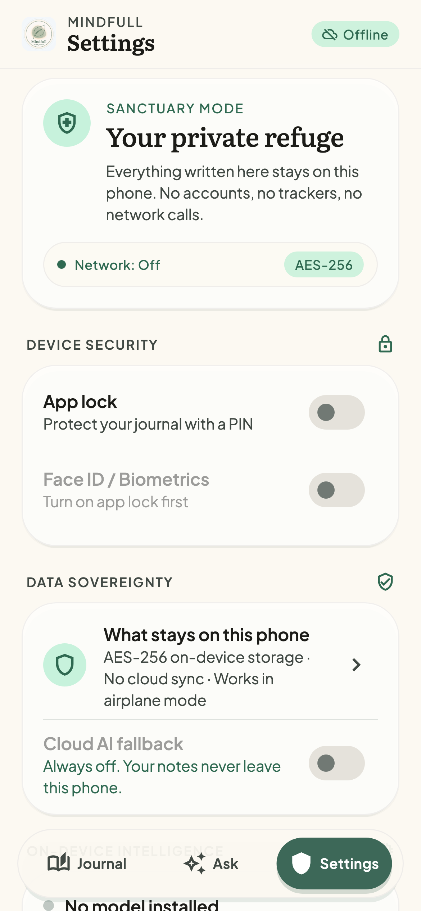

# Mindfull

An offline, private health and wellness journal for iOS and Android, built with Flutter. You log mood, symptoms, medication, sleep and notes, typed or dictated. Everything stays on the phone in an encrypted database, and the app works in airplane mode.

The next stage adds a language model (Gemma) that runs **entirely on the device**. It will answer questions about the journal ("When did my headaches start getting worse?"), cite the entries it used, and write a summary for a doctor's visit. No health data is sent to a server.

> Mindfull is a personal wellness journal, **not medical advice**. It does not diagnose or treat any condition.

<p>
  
  
  
  
</p>

## Status

| Week | Scope | State |
|---|---|---|
| 1 | Journal CRUD, encrypted DB, timeline, app lock, UI | ✅ Done |
| 2 | Model manager (device check, resumable download, checksum), first streamed Gemma chat | Next |
| 3 | On-device embeddings, local retrieval, "Ask your journal" with citations | Planned |
| 4 | Function calling with approval cards, reminders, weekly summary | Planned |
| 5 | Benchmarks, evaluation set, doctor-visit PDF, release | Planned |

## What works today

- **Journal:** mood (1–5), symptom and medication tags, sleep hours and free-text notes. Tag suggestions come from your own history, and you can edit or delete any entry.
- **Voice notes:** on-device speech recognition only. If the phone can't recognise speech locally, dictation fails; it never falls back to a server.
- **Timeline:** filter by date range, mood and tag. A 30-day summary shows entry count, average mood and sleep, and a mood chart.
- **Pattern card:** a "Gentle pattern noticed" card (for example, "Sleep under 6 h came before 3 of 4 migraine entries"). It is computed without AI and worded as a possible link, never a cause.
- **Encryption:** the database uses SQLCipher (AES-256). The key is 256 random bits kept in the iOS Keychain or Android Keystore, and it is excluded from backups.
- **App lock:** a PIN, stored as a salted PBKDF2 hash, plus Face ID or fingerprint. Repeated wrong PINs trigger a lockout that grows longer each time.
- **Screen privacy:** the app is blurred in the app switcher, and Android blocks screenshots.
- **Appearance:** light, dark or follow the system, with optional nature photo backgrounds. The fonts are bundled, so nothing is fetched at runtime.

## Architecture

The UI never calls platform or AI plugins directly. It goes through domain interfaces, so any implementation can be replaced with a fake in tests or swapped for another model.

```
lib/
  presentation/   screens, widgets, Riverpod notifiers
  domain/         entities, use cases (LogEntry, …)
                  interfaces: JournalRepo, LlmEngine, Embedder, Retriever, SpeechInput
  data/           db/ (drift + SQLCipher), repositories/, security/, speech/
  core/           theme (design tokens), router, providers
```

- **State and navigation:** Riverpod 3 and go_router.
- **Storage:** drift, with SQLCipher bundled through `package:sqlite3` build hooks (`hooks.user_defines.sqlite3.source: sqlcipher` in `pubspec.yaml`).
- **AI:** `LlmEngine`, `Embedder` and `Retriever` are interfaces today. Every AI screen shows a clear "model not ready" state, so the app is fully usable before a model is downloaded.

## Running it

Requirements: Flutter 3.41 or later (Dart 3.11), Xcode for iOS (deployment target iOS 16), and Android minSdk 24.

```sh
flutter pub get
dart run build_runner build --delete-conflicting-outputs   # drift code
flutter run
```

For a real iPhone, set your own development team and bundle ID in Xcode (`ios/Runner.xcworkspace`).

## Tests

```sh
flutter test --exclude-tags golden     # unit and widget tests
flutter test test/goldens              # screenshot (golden) tests
flutter test test/goldens --update-goldens
```

The tests cover these behaviours:
- The database file on disk contains no plaintext, and a wrong key is refused.
- PBKDF2 matches a published test vector (RFC 7914), and PIN lockout escalates.
- Entry filtering, and tags matched regardless of capitalisation.
- The full flows: create, edit and delete entries, dictation, app lock, the app-switcher shield, and theme switching.

## Privacy model (summary)

| What | Where it lives |
|---|---|
| Journal entries, tags | SQLCipher database in the app's private storage |
| Database key | Keychain / Keystore, bound to this device, not included in backups |
| PIN | Only a salted PBKDF2-SHA256 hash, in the Keychain / Keystore |
| Network | None for journal data. The only planned network use is the model download, which the user starts. |

What this can't protect against: someone who has your unlocked phone while Mindfull is open. The app lock adds a second barrier. A full threat model will be added in week 5.

## Credits

The UI was designed in Google Stitch. Fonts: [Literata](https://github.com/googlefonts/literata) and [Plus Jakarta Sans](https://github.com/tokotype/PlusJakartaSans), both under the SIL Open Font License (licence files are in `assets/fonts/`).

## License

MIT. See [LICENSE](LICENSE).
