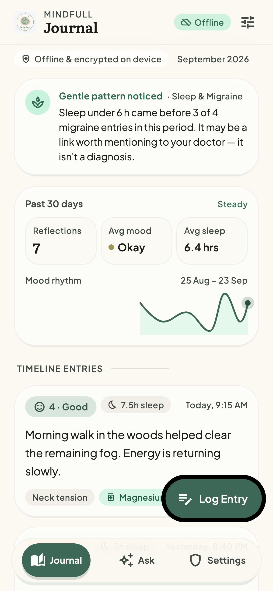
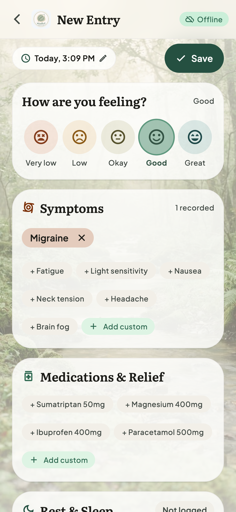
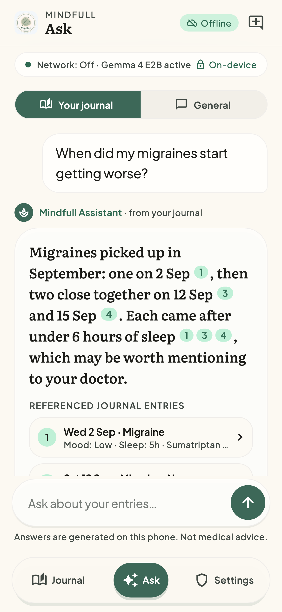
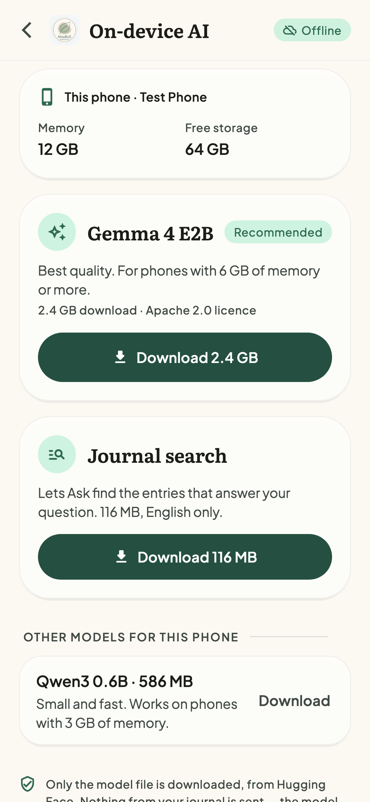
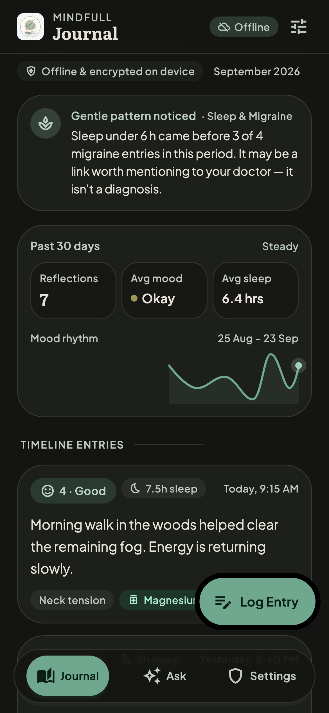

# Mindfull

An offline, private health and wellness journal for iOS and Android, built with Flutter. You log mood, symptoms, medication, sleep and notes, typed or dictated. Everything stays on the phone in an encrypted database, and the app works in airplane mode.

A language model (Gemma 4 E2B) runs **entirely on the device**. It answers questions about your journal ("When did my migraines start getting worse?") and cites the entries it used; tap a citation to open the entry. Next it will take actions (reminders) and write a summary for a doctor's visit. No health data is sent to a server.

> Mindfull is a personal wellness journal, **not medical advice**. It does not diagnose or treat any condition.

<p>
  
  
  
  
  
</p>

## Status

| Week | Scope | State |
|---|---|---|
| 1 | Journal CRUD, encrypted DB, timeline, app lock, UI | ✅ Done |
| 2 | Model manager (device check, resumable download, checksum), first streamed Gemma chat | ✅ On iPhone 17 Pro; second device pending |
| 3 | On-device embeddings, local retrieval, "Ask your journal" with citations | ✅ Built and tested; on-device check pending |
| 4 | Function calling with approval cards, reminders, weekly summary | Next |
| 5 | Benchmarks, evaluation set, doctor-visit PDF, release | Planned |

## What works today

- **Journal:** mood (1–5), symptom and medication tags, sleep hours and free-text notes. Tag suggestions come from your own history, and you can edit or delete any entry.
- **Voice notes:** on-device speech recognition only. If the phone can't recognise speech locally, dictation fails; it never falls back to a server.
- **Timeline:** filter by date range, mood and tag. A 30-day summary shows entry count, average mood and sleep, and a mood chart.
- **Pattern card:** a "Gentle pattern noticed" card (for example, "Sleep under 6 h came before 3 of 4 migraine entries"). It is computed without AI and worded as a possible link, never a cause.
- **Encryption:** the database uses SQLCipher (AES-256). The key is 256 random bits kept in the iOS Keychain or Android Keystore, and it is excluded from backups.
- **App lock:** a PIN, stored as a salted PBKDF2 hash, plus Face ID or fingerprint. Repeated wrong PINs trigger a lockout that grows longer each time.
- **Screen privacy:** the app is blurred in the app switcher, and Android blocks screenshots.
- **Appearance:** light, dark or follow the system, with optional nature photo backgrounds. The fonts are bundled, so nothing is fetched at runtime.
- **Model manager:** reads the phone's RAM and free storage, then recommends a model (table below). Downloads resume from the bytes already on disk after a pause, a dropped connection or the app being killed, using HTTP `Range` requests. Every file is checked against its published SHA-256 before use. You get a warning before downloading on mobile data, a storage check before starting, and a remove option. The "Offline" badge changes only while a download is running.
- **Ask your journal:** answers come only from your own entries and cite them as numbered chips. Tap one to open the entry; a *Referenced journal entries* list sits under each answer. Retrieval is hybrid (see Architecture), and the prompt includes counts computed from the whole journal, such as how many migraines each week, so trend answers rest on real numbers. A *General* mode keeps the private wellness chat.
- **On-device chat:** answers stream token by token, and **Stop** halts generation natively. Each answer shows time to first token and decode tokens/sec, counted with the model's own tokenizer. The model loads into memory only the first time you open Ask, so launches stay fast for people who only journal.

## On-device models

| Model | File | Size | Offered when | Licence |
|---|---|---|---|---|
| Gemma 4 E2B | `gemma-4-E2B-it.litertlm` | 2.4 GB | about 6 GB RAM or more (GPU) | Apache 2.0 |
| Qwen3 0.6B | `Qwen3-0.6B.litertlm` | 586 MB | about 3 GB RAM or more (CPU) | Apache 2.0 |
| Gecko 110M (search) | `Gecko_512_quant.tflite` + tokenizer | 116 MB | whenever a chat model is offered (English only) | Apache 2.0 |
| — | — | — | under 3 GB: AI turns off; the journal still works | — |

Neither model requires a Hugging Face token. The RAM thresholds sit about 10% below the advertised size, because phones report slightly less (an "8 GB" iPhone reports about 7.45 GiB).

## Benchmarks

| Device | Model | Backend | Time to first token | Decode | Build |
|---|---|---|---|---|---|
| iPhone 17 Pro (12 GB) | Gemma 4 E2B | GPU | 0.1 s | 37.3 tok/s | debug, single prompt |

These are early single runs. Week 5 adds a benchmark screen that averages repeated prompts in a profile build and records peak RAM and battery use per 10 prompts, on a budget Android phone as well as a flagship.

## Architecture

The UI never calls platform or AI plugins directly. It goes through domain interfaces, so any implementation can be replaced with a fake in tests or swapped for another model.

```
lib/
  presentation/   screens, widgets, Riverpod notifiers
  domain/         entities, use cases (LogEntry, …)
                  interfaces: JournalRepo, LlmEngine, Embedder, Retriever, SpeechInput
  data/           db/ (drift + SQLCipher), repositories/, security/, speech/
  core/           theme (design tokens), router, providers
```

- **State and navigation:** Riverpod 3 and go_router.
- **Storage:** drift, with SQLCipher bundled through `package:sqlite3` build hooks (`hooks.user_defines.sqlite3.source: sqlcipher` in `pubspec.yaml`).
- **AI:** `GemmaLlmEngine` (flutter_gemma 0.16 on LiteRT-LM) implements the `LlmEngine` interface. The downloaded, verified file is registered where it sits, not copied. `ModelManager` runs the lifecycle as a state machine: not installed → downloading or paused → verifying → installed → loading → ready, or failed or unsupported. Every AI screen renders from that state, so the app is fully usable before a model is downloaded.
- **Journal search (RAG):**
  - Each entry is embedded on the device with Gecko. Its vector is stored in an `entry_embeddings` table inside the same SQLCipher database, so it's deleted when the entry is, and it's re-embedded when the entry's text changes (tracked by hash) or the model changes.
  - flutter_gemma's own vector store is deliberately not used, because it keeps a plaintext copy of each document outside the encrypted database.
  - The retriever combines three signals. Date phrases ("last week", "since June", "in August") set a range. Symptom and medication names you've logged, including simple plurals, get a boost. Cosine similarity ranks the rest, with a small recency bonus; entries not yet indexed fall back to word overlap.
  - The top 8 entries are numbered in date order. The model is told to answer only from them, cite them as `[n]`, say when the journal doesn't contain the answer, and never diagnose.
- **Native code:** a small `mindfull/device` platform channel (Swift and Kotlin) reports total RAM and free storage, and on iOS excludes model files from iCloud backup. The iOS app has the Increased Memory Limit and Extended Virtual Addressing entitlements, so large models can load.

## Running it

Requirements: Flutter 3.41 or later (Dart 3.11), Xcode for iOS (deployment target iOS 16), and Android minSdk 24.

```sh
flutter pub get
dart run build_runner build --delete-conflicting-outputs   # drift code
flutter run
```

For a real iPhone, set your own development team and bundle ID in Xcode (`ios/Runner.xcworkspace`).

## Tests

```sh
flutter test --exclude-tags golden     # unit and widget tests
flutter test test/goldens              # screenshot (golden) tests
flutter test test/goldens --update-goldens
```

The tests cover these behaviours:
- The database file on disk contains no plaintext, and a wrong key is refused.
- PBKDF2 matches a published test vector (RFC 7914), and PIN lockout escalates.
- Entry filtering, and tags matched regardless of capitalisation.
- The full flows: create, edit and delete entries, dictation, app lock, the app-switcher shield, and theme switching.
- Model downloads against a local HTTP server: redirects, Range resume, servers that ignore Range, 404s, stalled connections and pause.
- The model lifecycle: a wrong checksum deletes the file, low storage is refused, a download resumes after a restart, the model loads lazily, and a failed load is reported instead of crashing.
- The chat: streaming, Stop reaching the engine, new chat, and the model-manager route.
- Journal search:
  - The date and tag parser.
  - A retrieval check on a synthetic migraine journal: each question must retrieve its known source entries.
  - The facts, the prompt and the citation parser.
  - Vector round-trip and cascade delete in SQLCipher.
  - Incremental re-indexing.
  - The search-model download.
  - Tapping a citation opens the right entry.

## Privacy model (summary)

| What | Where it lives |
|---|---|
| Journal entries, tags | SQLCipher database in the app's private storage |
| Database key | Keychain / Keystore, bound to this device, not included in backups |
| PIN | Only a salted PBKDF2-SHA256 hash, in the Keychain / Keystore |
| Network | None for journal data. The only network use is the model download from Hugging Face, which the user starts. |
| Model files | App-private storage, excluded from iCloud backup, never visible in the Files app |
| Search vectors | In the SQLCipher database next to the entries, never in a separate plaintext index |

What this can't protect against: someone who has your unlocked phone while Mindfull is open. The app lock adds a second barrier. A full threat model will be added in week 5.

## Credits

The UI was designed in Google Stitch. Fonts: [Literata](https://github.com/googlefonts/literata) and [Plus Jakarta Sans](https://github.com/tokotype/PlusJakartaSans), both under the SIL Open Font License (licence files are in `assets/fonts/`).

## License

MIT. See [LICENSE](LICENSE).
